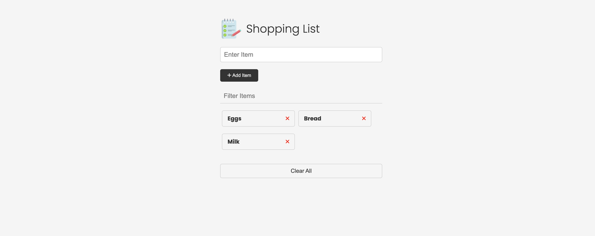
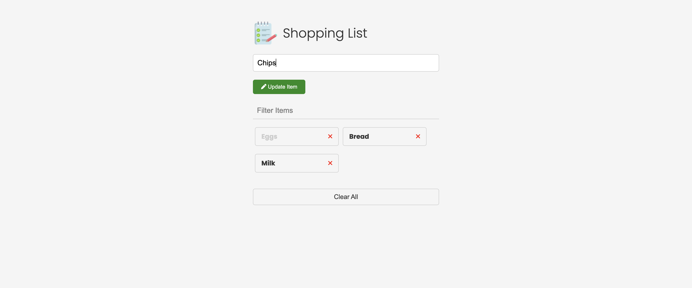

# Shopping List 

This is a simple web application for managing your shopping list. It is built using HTML, CSS, and JavaScript, and is deployed on Netlify.

## Features

- Add items to your shopping list
- Mark items as purchased
- Remove items from your shopping list
- Clear the entire shopping list

## Technologies Used

- HTML
- CSS
- JavaScript

## Usage

- Add items to your shopping list using the input field and "Add Item" button
- Update an item by clicking on it, updating it in the input field, and clicking the "Update Item" button
- Remove items from your shopping list by clicking the "Remove" button next to them
- Clear the entire shopping list by clicking the "Clear All" button

## Deployment

This project is deployed on Netlify. You can access it [here](https://myshoppingchecklist.netlify.app/).

## Screenshots

